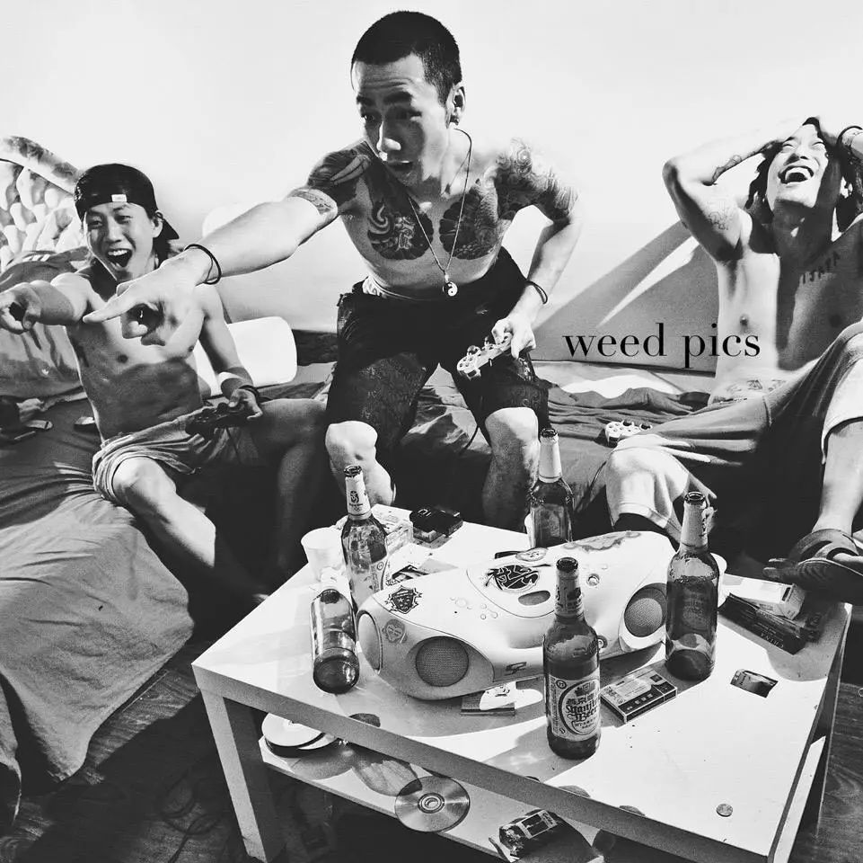

# Hi there 👋

```python

class Me:
    def __init__(self):
        self.name = 'GreenH47'
        self.languages = ['Chinese','English','Mongolian']
        self.programming = ['Python','Java','SQL','HTML']
        self.status= 'Studying in Monash Uni'
```
  


### ⚙️ GitHub Stats

[](https://github.com/anuraghazra/github-readme-stats)

### 🛠 Programming Languages
[](https://github.com/anuraghazra/github-readme-stats)


```python

北京晚报,有人在找有人在照, 打架多数还是人多的欺负人少
北京晚报,有人睡地下通道, 有人公款吃喝国家给报销
北京晚报,有人迟到有地儿验尿, 危险就在身边玩儿的就是心跳
北京晚报,北京会越来越热闹, 但我们再也找不回从前的味道

Artist:In3  
Song: 北京晚报 (Beijing Evening News) 
Track: 未知艺术家 (Unkown Artist) Track 8
```


